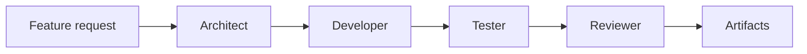

# Takumi

**Takumi** is an AI-powered multi-agent software engineering system that simulates a complete development team to design, build, test, and iterate on software automatically.

Inspired by the Japanese concept of *takumi* — a master craftsman — this project treats software development as a craft, where specialized AI agents collaborate like an engineering team: from product understanding and system design to implementation, testing, and review.

Takumi orchestrates a structured software development lifecycle (SDLC) using agent-based workflows. Each agent plays a distinct role in the process, ensuring modularity, traceability, and iterative improvement. The goal is not just code generation, but the autonomous execution of well-engineered software development pipelines.

This project explores the future of agentic software engineering, where AI systems don't just assist developers — they act as a coordinated engineering organization.

## Vision

> Describe a feature. Takumi returns a production-ready implementation — as if a real engineering team had built it.

## Key concepts

- **Multi-agent architecture** — specialized agents for architecture, development, testing, and review
- **SDLC automation** — planning → architecture → implementation → testing → review
- **Tool-augmented agents** — code execution, testing, and repository manipulation *(roadmap)*
- **Iterative feedback loops** — debugging and refinement across agent handoffs *(roadmap)*
- **LangGraph orchestration** — stateful workflows built on LangChain / LangGraph

## How it works



| Agent | Role |
|-------|------|
| **Architect** | Analyzes requirements and proposes system design |
| **Developer** | Implements the design with clean, maintainable code |
| **Tester** | Defines test strategy and validates behavior |
| **Reviewer** | Reviews output for quality and best practices |

## Requirements

- Python 3.12+
- [uv](https://docs.astral.sh/uv/)
- An LLM provider: OpenAI, Anthropic, or [Ollama](https://ollama.com) (local)

## Quick start

```bash
# Install dependencies
uv sync

# Configure environment
cp .env.example .env
# Edit .env — set a cloud API key or use Ollama locally (see below)

# Verify installation
uv run takumi version
uv run takumi config

# Run the multi-agent workflow
uv run takumi run "Add user authentication with JWT"
```

## Configuration

| Variable | Description | Default |
|----------|-------------|---------|
| `LLM_PROVIDER` | `openai`, `anthropic`, or `ollama` | `openai` |
| `OPENAI_API_KEY` | OpenAI API key | — |
| `ANTHROPIC_API_KEY` | Anthropic API key | — |
| `OPENAI_MODEL` | OpenAI model name | `gpt-4o` |
| `ANTHROPIC_MODEL` | Anthropic model name | `claude-sonnet-4-20250514` |
| `OLLAMA_BASE_URL` | Ollama server URL | `http://localhost:11434` |
| `OLLAMA_MODEL` | Ollama model name | `llama3.2` |
| `LOG_LEVEL` | Log level | `INFO` |

## Local with Ollama

Run models locally without cloud API keys:

```bash
# 1. Install and start Ollama (https://ollama.com)
ollama serve

# 2. Pull a model
ollama pull llama3.2

# 3. Configure Takumi
cat >> .env <<'EOF'
LLM_PROVIDER=ollama
OLLAMA_MODEL=llama3.2
EOF

# 4. Run
uv run takumi run "Add user authentication with JWT"
```

Recommended models for coding: `qwen2.5-coder`, `codellama`, `deepseek-r1`.

## Project structure

Organized with DDD-style boundaries: bounded contexts for domain logic, shared kernel for cross-cutting concerns.

```
src/takumi/
├── contexts/           # Bounded contexts
│   ├── orchestration/  # LangGraph workflow, state, routing
│   └── team/           # Agent roles and configuration
├── shared/             # Cross-cutting kernel and infrastructure
│   ├── config/         # Settings and environment
│   ├── llm/            # LLM provider factory (OpenAI, Anthropic, Ollama)
│   ├── presentation/   # CLI, future API
│   └── tools/          # Development tools (future)
└── main.py             # CLI entrypoint
```

## Development

```bash
uv sync --dev
uv run pytest
uv run ruff check .
```

## Roadmap

- [ ] Real development tools (filesystem, git, shell, test runner)
- [ ] Agent-specific prompts and reasoning
- [ ] Persistent memory and LangGraph checkpoints
- [ ] Quality gates and iterative feedback loops
- [ ] Integration with sisques-labs agent/prompt services
- [ ] REST API

## License

Private — sisques-labs
